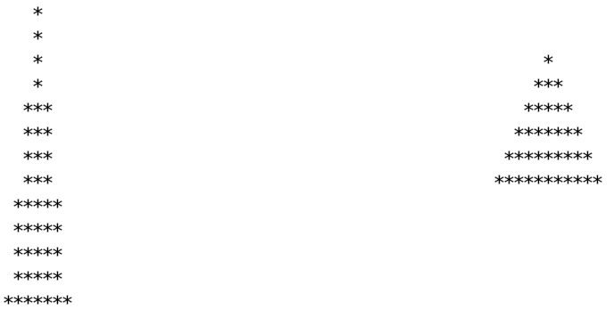

# TPA 2020 - Shape Display
Questa repository contiene il testo dell'esame del corso "Tecniche di Programmazione Avanzata" del Dipartimento di Ingegneria Industriale, anno accademico 2019/2020.

# Istruzioni
L'esercizio consiste nella progettazione e nell'implementazione di un software C++ per la visualizzazione 
di forme geometriche su console/terminale. 
Il software deve essere scritto mediante il paradigma di programmazione ad oggetti, quindi utilizzando 
ad esempio (ove possibile e sensato):
 * classi
 * incapsulamento
 * ereditarietà
 * polimorfismo
 * passaggio per riferimento
 * passaggio per riferimento costante
 * puntatori
 * metodi const
 * operatori
 * overload
 * valori di default
 * template

Nessun codice di partenza è fornito. Lo studente deve occuparsi sia della progettazione che 
dell'implementazione. Si consiglia di sottomettere anche il progetto del software, soprattutto se 
l'implementazione dovesse essere incompleta (ad esempio per mancanza di tempo). 
Il progetto sarà tenuto in conto nella valutazione finale. 
Formati accettabili per il progetto sono formati visuali (come pdf o jpeg) o formati testuali 
semplici (come txt o rtf). 
Idealmente l'implementazione dovrebbe includere anche una serie di test per verificare il corretto 
funzionamento del codice scritto.

# Descrizione
Il software deve permettere la visualizzazione a console di semplici figure geometriche 2D, come
triangoli, rettangoli e cerchi.
La console può essere usata come un display, dove ogni pixel corrisponde ad un carattere.
Le figure geometriche sono create dall'utente specificandone forma, dimensioni, e posizione sul display.
Successivamente, queste figure possono essere visualizzate sulla console.
Le figure devono essere visualizzate "piene", stampando degli asterischi (*) in corrispondenza 
dei pixel all'interno delle figure, e stampando degli spazi in corrispondenza dei pixel liberi.
Il display deve avere una larghezza ed una altezza, specificate dall'utente
tramite numeri interi.
Eventuali figure posizionate al di fuori del display non devono essere visualizzate.

## Esempio
Nell'esempio qui sotto, il software è utilizzato per visualizzare due triangoli.



In questo esempio l'origine (x=0,y=0) del sistema di riferimento utilizzato corrisponde all'angolo in basso
a sinistra della console, l'asse x punta verso destra, mentre l'asse y punta verso l'alto.
Il primo triangolo ha una base di 6 unità (ovvero 6 caratteri), un'altezza di 12 unità, ed il vertice 
in basso a sinistra è situato nella coordinata (x=0, y=0).
Il secondo triangolo invece ha una base di 10 unità, un'altezza di 5 unità, ed il vertice 
in basso a sinistra è situato nella coordinata (x=50, y=5).

Notare che in questo esempio, sembra che le dimensioni dei triangoli siano di 
una unità più lunghe. 
Ad esempio, la base del primo triangolo è di 6 caratteri, ma nella figura è rappresentata con 7
asterischi.
Questo effetto è dovuto a come è stata implementata la discretizzazione in pixel, ma questo genere di dettagli di 
visualizzazione è irrilevante per la valutazione dell'esame.
Inoltre, la scelta del sistema di riferimento è libera, quindi lo studente può decidere di utilizzare
un sistema di riferimento diverso da quello dell'esempio (ad esempio con l'asse y che punta verso il basso).

## Specifiche

Il software deve permettere all'utente di:
* creare un display specificandone la dimensione
* creare figure geometriche specificandone dimensioni e posizione
* aggiungere figure geometriche al display
* rimuovere figure geometriche dal display
* aggiornare la visualizzazione del display quando una figura è aggiunta o rimossa
* calcolare l'area totale di tutte le figure visualizzate

Il codice inoltre deve sfruttare la programmazione ad oggetti (ereditarietà e 
polimorfismo) per essere facilmente estendibile, ad esempio aggiungendo 
nuove tipologie di figure geometriche (ad esempio: ellissoidi, o rombi).

## Codice Utile

Per verificare se un punto 2D si trova all'interno di un triangolo, il seguente codice può 
essere utilizzato:
```
class Point {
public:
    double x;
    double y;
};

double sign(Point p1, Point p2, Point p3)
{
    return (p1.x - p3.x) * (p2.y - p3.y) - (p2.x - p3.x) * (p1.y - p3.y);
}

/**
 * Verifica se il punto pt si trova all'interno del triangolo
 * con vertici v1, v2, v3.
 */
bool isPointInTriangle(Point pt, Point v1, Point v2, Point v3)
{
    double d1 = sign(pt, v1, v2);
    double d2 = sign(pt, v2, v3);
    double d3 = sign(pt, v3, v1);

    bool has_neg = (d1 < 0) || (d2 < 0) || (d3 < 0);
    bool has_pos = (d1 > 0) || (d2 > 0) || (d3 > 0);

    return !(has_neg && has_pos);
}
```
